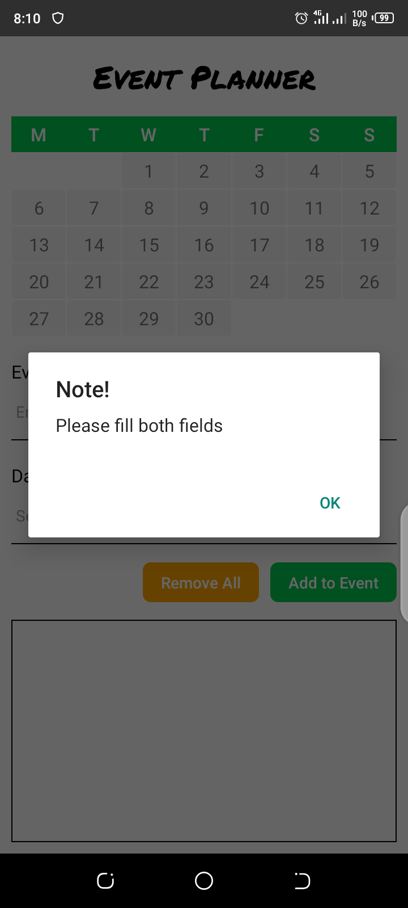
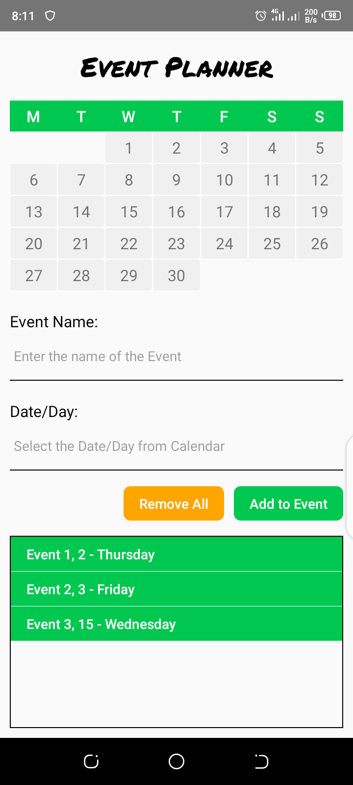

# Event Planner

This is a simple Event Planner application that is created in **React Native**.

## :camera_flash: Screens

  

## 🧑 Author

#### Muhammad Sarmad Qadeer

You can also follow my GitHub Profile to stay updated about my latest projects:

If you liked the repo then kindly support it by giving it a star ⭐!

Copyright (c) 2022 MUHAMMAD SARMAD QADEER
